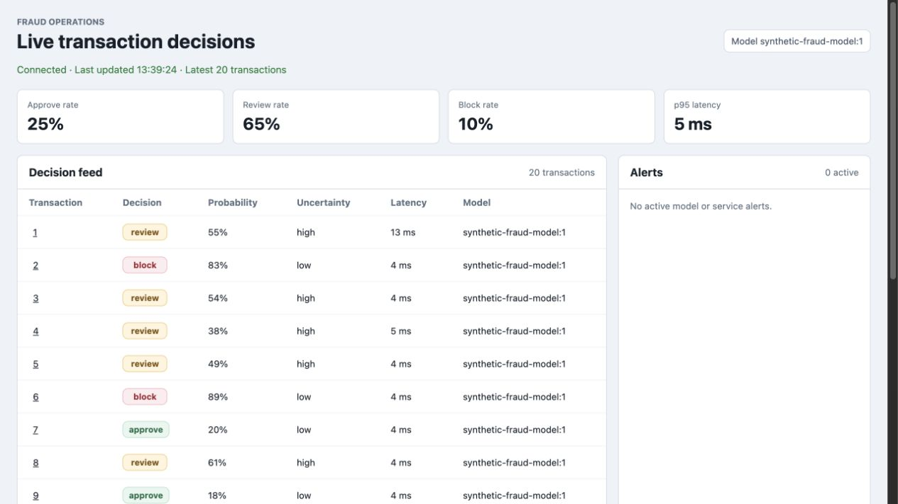
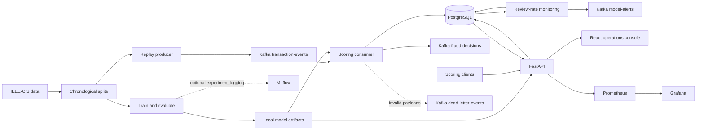

# Fraud Detection ML Platform

[](https://github.com/abheeeshekdutta/fraud-detection-ml-platform/actions/workflows/ci.yml)

An end-to-end fraud decision system connecting time-aware machine learning, Kafka streaming,
FastAPI serving, and a live operations console. Transactions receive an **approve**, **review**,
or **block** decision with model lineage, probability, uncertainty, and analyst reason codes.



*Console preview using 20 synthetic transactions scored locally; displayed metrics are illustrative.*

## Engineering highlights

- **Shared offline and online features:** the same preprocessing pipeline serves logistic regression,
  CatBoost, and LightGBM; replay preserves transaction time to prevent training/serving skew.
- **Decision quality beyond AUC:** separate chronological train, calibration, validation, and replay
  splits; probability calibration; split-conformal uncertainty; cost and capacity constrained thresholds.
- **Recoverable event processing:** explicit Kafka acknowledgements before offset commits, invalid
  payload routing, and prediction upserts keyed by event ID.
- **Persistent scoring:** synchronous and streaming decisions reach the same PostgreSQL prediction
  store, with model, feature-schema, and policy versions attached to every result.
- **Operational visibility:** a React console with live decisions, review rates, latency, reason codes,
  connection status, and alerts; Prometheus metrics and provisioned Grafana dashboards.
- **Reproducible delivery:** locked Python and JavaScript dependencies, health-gated Docker Compose
  startup, a deterministic synthetic demo, regression tests, and GitHub Actions including live Kafka and full Compose testing.

## Architecture



See [architecture and delivery semantics](docs/architecture.md) for component boundaries and failure handling.

## Run the synthetic demo

Requires Python 3.11, [uv](https://docs.astral.sh/uv/), and Docker with Compose and a running daemon.
All services run locally; the demo requires no dataset download or external account.

```bash
uv sync --locked --extra dev
make demo-up
```

This generates a demonstration model and 200 deterministic transactions under `artifacts/demo/`,
then starts the stack. The producer finishes after replaying its input; the API and console remain
available. Existing IEEE-CIS data and model files are preserved.

| Service | Address |
| --- | --- |
| Operations console | http://localhost:5173 |
| Interactive API | http://localhost:8000/docs |
| MLflow | http://localhost:5001 |
| Grafana | http://localhost:3000 |
| Prometheus | http://localhost:9090 |

The synthetic model verifies integration behavior only. Its scores are not evidence of fraud
predictive performance. Synthetic training does not create an MLflow experiment run.

Replay again or stop the stack:

```bash
docker compose -f docker-compose.yml -f docker-compose.demo.yml run --rm transaction-producer
docker compose -f docker-compose.yml -f docker-compose.demo.yml down
```

PostgreSQL data persists in a named volume. Each replay creates new event IDs and adds a new set
of decisions. Dashboard percentages and p95 describe the latest fetched window, not all history.

### Score a transaction

```bash
curl --fail-with-body http://localhost:8000/score \
  -H 'Content-Type: application/json' \
  -d '{"event_id":"example-001","transaction_id":10001,"event_time":"2026-09-11T12:00:00Z","transaction_dt":3600.0,"amount":75.0,"product_cd":"W","schema_version":"v1"}'
```

The result is saved before the API returns and appears in the console on its next refresh.
Reusing an event ID updates its stored decision. See [the local walkthrough](docs/demo-script.md).

## Train on IEEE-CIS

Place the transaction and identity training CSV files in `data/raw/` after obtaining the dataset
under its source terms. Raw data, fitted models, and generated reports are excluded from Git.

```bash
uv run fraud-train --prepare-ieee --raw-dir data/raw --processed-dir data/processed
uv run fraud-train --ieee-baseline --processed-dir data/processed \
  --output-dir artifacts/model/latest --max-train-rows 100000 --model-candidate lightgbm

docker compose up --build -d
```

Add `--tune-hyperparameters` for chronological cross-validation. To track experiments, start
`docker compose up -d mlflow` and add `--mlflow-tracking-uri http://localhost:5001` to training.
The [operator runbook](docs/runbook.md) covers calibration, conformal artifacts, threshold analysis,
SHAP reports, and monitoring.

### Recorded baseline results

The existing [IEEE-CIS analysis](docs/ieee-cis-analysis.md) reports these first-pass validation
results using the most recent 100,000 training rows and 88,581 later validation transactions:

| Model | ROC-AUC | PR-AUC | Brier score ↓ |
| --- | ---: | ---: | ---: |
| Logistic regression | 0.7543 | 0.1111 | 0.0303 |
| CatBoost | 0.7526 | 0.1309 | 0.0300 |
| LightGBM | 0.7677 | 0.1503 | 0.0297 |

These are historical measurements recorded in this repository, not results regenerated by CI.
They predate the serving and uncertainty fixes in this release. Re-evaluate artifacts and decision
thresholds before relying on them. The [model card](docs/model-card.md) explains dataset,
calibration, threshold tradeoffs, and limitations.

## Development and verification

```bash
uv sync --locked --extra dev
make check                 # Python lint/tests, dashboard tests, production frontend build
make demo                  # Generate standalone synthetic artifacts

docker compose up -d --wait kafka
make integration           # Real broker: scoring, invalid event routing, offset verification
```

`make check` also needs Node.js 22+ and npm. The broker test is opt-in locally and runs in its own
CI job. A separate Compose job builds the images and verifies replay-to-database-to-API flow
with `scripts/smoke_compose.py`. An end-to-end local test trains a model, scores HTTP requests, persists them to SQLite,
and reads the dashboard feed without Docker. PostgreSQL remains the Compose runtime database.

## Documentation

- [Architecture and failure semantics](docs/architecture.md)
- [API and event contracts](docs/data-contracts.md)
- [Local walkthrough](docs/demo-script.md)
- [Docker operations](docs/docker-runbook.md) · [Deployment](docs/deployment.md)
- [Operator runbook](docs/runbook.md) · [Execution reference](docs/execution-runbook.md)
- [Modeling](docs/modeling.md) · [Model card](docs/model-card.md)
- [Feature engineering](docs/feature-engineering.md) · [Hyperparameter tuning](docs/hyperparameter-tuning.md)
- [Data profile](docs/data-profile.md) · [IEEE-CIS analysis](docs/ieee-cis-analysis.md)
- [Monitoring](docs/monitoring.md) · [Validation record](docs/validation.md)
- [Contributing](CONTRIBUTING.md) · [Release notes](CHANGELOG.md)

## Deployment boundary

This is a self-hosted engineering reference with a working local deployment. It has no public API
authentication, automated model promotion, or production load benchmark. Runtime reason codes are
heuristics; SHAP is generated offline. Delayed labels can be published, but the worker currently
monitors the persisted review rate rather than consuming labels. Conformal coverage depends on
exchangeability and is not guaranteed under temporal drift. See the model card and architecture
for the full operational boundary.
