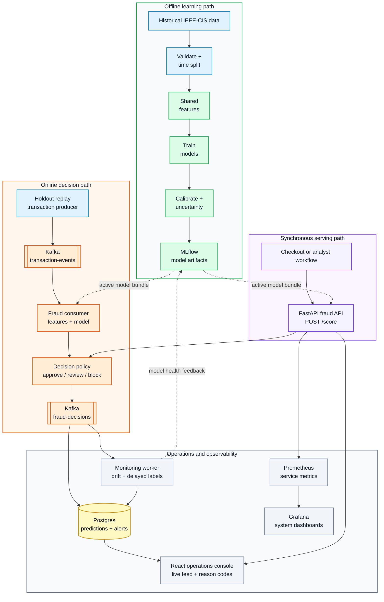

# Fraud Detection ML Platform

A local ML platform for scoring e-commerce payment transactions and monitoring fraud decisions.

The platform includes:

- time-aware fraud modeling on realistic tabular data
- Kafka-based real-time transaction scoring
- calibrated probabilities and conformal uncertainty
- explainable fraud decisions for analyst review
- model monitoring, drift checks, and operational observability
- reproducible local deployment with free/open-source tooling

## Use Case

The system scores incoming e-commerce payment transactions and returns one of three decisions:

- `approve`: low fraud risk and low uncertainty
- `review`: uncertain, borderline, or operationally suspicious
- `block`: high fraud risk and low uncertainty

The project uses the IEEE-CIS Fraud Detection dataset as the historical data source. The dataset contains transaction and identity files joined by `TransactionID`; not every transaction has identity data, which creates realistic missingness and enrichment behavior.

## Runtime Philosophy

Required spend: `$0`.

The default stack is self-hosted locally with Docker Compose and open/free tooling. No managed cloud services, paid APIs, paid monitoring products, or proprietary databases are required.

Recommended local container runtime on macOS:

- Colima + Docker CLI, to avoid Docker Desktop licensing concerns

## Core Stack

- Python 3.11
- uv for Python dependency and environment management
- Apache Kafka in KRaft mode
- FastAPI
- PostgreSQL
- MLflow OSS
- CatBoost, LightGBM, and scikit-learn
- MAPIE for conformal prediction
- SHAP for explainability
- Evidently OSS for model/data monitoring
- Prometheus and Grafana OSS
- React + Vite for the fraud operations console
- Docker Compose for local deployment

## System Shape



## Quickstart

1. Install Python 3.11 and `uv`.
2. Copy `.env.example` to `.env`.
3. Run `uv sync --extra dev`.
4. Run `uv run fraud-train --synthetic --output-dir artifacts/model/latest`.
5. Run `docker compose up --build`.
6. Open:
   - dashboard: `http://localhost:5173`
   - fraud API: `http://localhost:8000/docs`
   - MLflow: `http://localhost:5001`
   - Grafana: `http://localhost:3000`
   - Prometheus: `http://localhost:9090`

If IEEE-CIS data is available in `data/raw`, use the real-data baseline instead:

```bash
uv run fraud-train --prepare-ieee --raw-dir data/raw --processed-dir data/processed
uv run fraud-train --ieee-baseline --processed-dir data/processed --output-dir artifacts/model/latest --max-train-rows 100000
```

The real-data baseline writes a local model bundle to `artifacts/model/latest`. To also log metrics,
parameters, and the sklearn model to MLflow, start the local MLflow service first and pass
`--mlflow-tracking-uri http://localhost:5001`. The current IEEE-CIS baseline is a comparison floor.
CatBoost and LightGBM benchmarking comes next.

## Documentation

- [Architecture](docs/architecture.md)
- [Data Contracts](docs/data-contracts.md)
- [Execution Runbook](docs/execution-runbook.md)
- [Operator Runbook](docs/runbook.md)
- [Local Walkthrough](docs/demo-script.md)
- [IEEE-CIS Data Profile](docs/data-profile.md)
- [IEEE-CIS Findings And Baseline Analysis](docs/ieee-cis-analysis.md)
- [Modeling Plan](docs/modeling.md)
- [Monitoring Plan](docs/monitoring.md)
- [Deployment Plan](docs/deployment.md)
- [Model Card](docs/model-card.md)
- [Superpowers Design Spec](docs/superpowers/specs/2026-06-10-fraud-detection-platform-design.md)

## Status

The local platform currently supports the first end-to-end smoke path:

- strict event contracts
- feature pipeline foundation
- model artifact packaging
- scoring API
- Kafka replay and consumer skeleton
- prediction and alert storage schema
- monitoring calculations
- React operations dashboard
- Docker Compose observability stack
