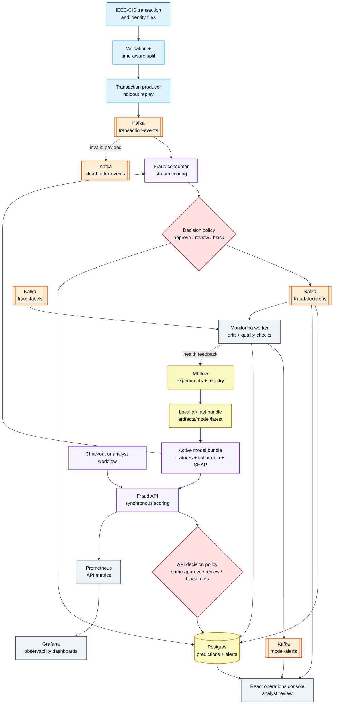

# Architecture

## Goal

This document describes a local fraud detection platform that scores transactions in near real time, explains risk decisions, and monitors model health over time.

The architecture separates offline model development, online scoring, monitoring, and analyst review into distinct components.

## Event Flow



## Major Components

### Transaction Producer

Reads held-out IEEE-CIS transactions in timestamp order and publishes them to Kafka as simulated live payment events.

Responsibilities:

- load production replay split
- preserve event-time ordering
- optionally control replay speed
- optionally inject drift scenarios
- publish valid transaction events to `transaction-events`

### Kafka

Apache Kafka provides the event backbone.

Initial topics:

- `transaction-events`: incoming transaction scoring requests
- `fraud-decisions`: model scores, decisions, reason codes, and uncertainty
- `fraud-labels`: delayed labels for monitoring and retraining simulation
- `model-alerts`: drift and operational alerts
- `dead-letter-events`: invalid or unprocessable messages

Kafka should run in KRaft mode through Docker Compose.

### Fraud Consumer

Consumes `transaction-events`, scores each transaction, writes the result to `fraud-decisions`, and persists prediction records.

Responsibilities:

- deserialize and validate transaction payloads
- apply production feature pipeline
- load active model artifact
- calculate calibrated fraud probability
- calculate conformal prediction set or uncertainty flag
- generate SHAP-based reason codes
- apply decision policy
- persist prediction metadata and emit decision events

### Fraud API

FastAPI service for synchronous scoring and operational endpoints.

Endpoints:

- `POST /score`: score a transaction synchronously
- `GET /health`: service health
- `GET /model-info`: active model metadata
- `GET /metrics`: Prometheus-compatible metrics

This mirrors the checkout service path while Kafka powers replay, streaming, and downstream monitoring.

### Training Pipeline

Builds reproducible offline models.

Responsibilities:

- data loading and joining
- time-aware split
- data validation
- feature engineering
- baseline model
- CatBoost and LightGBM candidates
- calibration
- conformal calibration
- threshold and decision policy selection
- MLflow experiment tracking
- model artifact packaging

### Monitoring Worker

Evaluates production-like traffic and emits alerts.

Responsibilities:

- data drift
- missingness drift
- score distribution drift
- latency and throughput checks
- delayed-label performance checks
- conformal coverage checks
- alert writing to Postgres and Kafka

### Dashboard

React + Vite fraud operations console.

Views:

- live transaction decision feed
- fraud score distribution
- approve/review/block rates
- model version and serving health
- latency and throughput
- drift and alert panel
- transaction detail drawer with reason codes

## Decision Flow

```text
incoming event
   |
schema validation
   |
feature pipeline
   |
model probability
   |
probability calibration
   |
conformal uncertainty
   |
decision policy
   |
approve / review / block
```

## Production Principles

- Offline and online feature code should share the same transformations where practical.
- Time-based validation is preferred over random splitting.
- Every prediction should carry model version, feature schema version, and decision policy version.
- Uncertainty should be routed to review rather than hidden.
- Monitoring should evaluate both model quality and system behavior.
